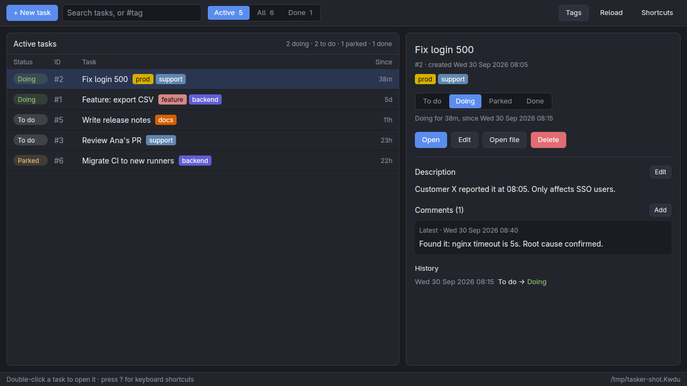

# tasker

[](https://github.com/singudotdev/tasker/actions/workflows/ci.yml)
[](LICENSE)

**A todo tracker for the terminal and the desktop**: tasks move between **todo**, **doing**, **parked** and **done**,
with tags, a description and comments, and tasker remembers when each status changed.
Everything is stored in plain **markdown files** that you can read, edit, grep and version with git, with no database.

Pick the app you like, or use both on the same tasks:

- **`tasker`**, the terminal UI: keyboard-first in the "lazy" style of lazygit, a single tiny binary that also works over SSH.
- **`tasker-gui`**, the desktop app: a conventional window with buttons, dialogs and double-click to open.



The terminal UI:

```
┌ tasker ────────────────────────────────────────────────────────────────────────────────────────────────────┐
│ ▶ 2 doing    · 2 todo    ‖ 1 parked    ✓ 1 done                                                            │
└────────────────────────────────────────────────────────────────────────────────────────────────────────────┘
┌ tasks · 1 done hidden (f) ─────────────────────────────────────┐┌ details ─────────────────────────────────┐
│    id    task                         tags                since││#2 Fix login 500                          │
│› ▶ #2    Fix login 500                 prod   support     9h   ││ prod   support                           │
│  ▶ #1    Feature: export CSV           feature   backend  6d   ││                                          │
│  · #5    Write release notes           docs               11h  ││status    ▶ doing for 9h                  │
│  · #3    Review Ana's PR               support            1d   ││since     Mon 28 Sep 2026 10:15           │
│  ‖ #6    Migrate CI to new runners     backend            1d   ││created   Mon 28 Sep 2026 10:05           │
│                                                                ││                                          │
│                                                                ││History                                   │
│                                                                ││Mon 28 Sep 2026 10:15  todo → ▶ doing     │
│                                                                ││                                          │
│                                                                ││Description  (m) edit  (v)iew             │
│                                                                ││Customer X reported it at 10:05. Only     │
│                                                                ││affects SSO users.                        │
│                                                                ││                                          │
│                                                                ││Comments (1)  (c) add  (v)iew             │
│                                                                ││latest · Mon 28 Sep 2026 10:40            │
│                                                                ││Found it: nginx timeout is 5s. Root cause │
│                                                                ││confirmed.                                │
└────────────────────────────────────────────────────────────────┘└──────────────────────────────────────────┘
 (↑↓/jk) move  (n)ew  (s)tart  (p)ark  (d)one  (b)ack to todo  (e)dit  (v)iew  (m) description  (c)omment
 (o)pen file  (x) delete  (/) search  (f)ilter  (t)ags  (R)eload  (?) keys  (q)uit
```

## Features

- **Two apps, one set of tasks.** Both read and write the same markdown files with the same logic, so you can switch any time,
  or keep the desktop app open while you use the terminal.
- **Lazy by design** in the terminal, in the spirit of lazygit and lazyssh: a task list plus a details panel, one key per action,
  a footer that always shows the keys for the current screen, a runnable `?` menu, and mouse support. There's nothing to configure.
- **Point and click** on the desktop: a toolbar with New task, search and Active / All / Done filters; status buttons;
  Edit, Delete and Add comment buttons where you need them; right-click menus; text fields that select and paste like
  any desktop app. The terminal's keys still work there (`?` lists them).
- **todo, doing, parked, done** with one key each (`s` start, `p` park, `d` done, `b` back to todo). Any number of tasks can be in doing.
- **Status history:** every change is recorded with its date, and the list shows how long each task has been in its status.
- **Tasks work like issues:** each has a description and timestamped comments that you can add, edit and delete (`v`, `m`, `c`).
- **Tags** with stable colored chips, Proxmox style, shown wherever a task appears. Rename, merge, recolor or delete them from the tags screen (`t`).
- **Search** with `/` across titles and tags (`#prod` matches tags only).
- **`tasker list`** prints your tasks as markdown, by status and tag (`tasker list | wl-copy`).
- **Runs on Linux, macOS and Windows.** Each app is a single binary written in Rust.

## Install

**Linux / macOS**

```sh
curl -fsSL https://raw.githubusercontent.com/singudotdev/tasker/main/install.sh | sh                   # terminal UI
curl -fsSL https://raw.githubusercontent.com/singudotdev/tasker/main/install.sh | sh -s -- --app gui   # desktop app
curl -fsSL https://raw.githubusercontent.com/singudotdev/tasker/main/install.sh | sh -s -- --app both  # both
# or: wget -qO- https://raw.githubusercontent.com/singudotdev/tasker/main/install.sh | sh
```

**Windows** (PowerShell)

```powershell
irm https://raw.githubusercontent.com/singudotdev/tasker/main/install.ps1 | iex                            # terminal UI
$env:TASKER_APP = "gui"; irm https://raw.githubusercontent.com/singudotdev/tasker/main/install.ps1 | iex   # desktop app ("both" for both)
```

Each installer downloads a single file per app for your system, verifies its checksum and installs it **for your user only**.
The desktop app also gets an entry in your application menu (Linux) or Start Menu (Windows). Don't use `sudo` or an administrator shell: the installers refuse both, and they only install inside your home folder.
To build from source instead, see [Getting started](docs/getting-started.md).

## Documentation

| | |
| --- | --- |
| [Getting started](docs/getting-started.md) | install, first run, where data lives |
| [Tasks, tags & search](docs/tasks-and-tags.md) | statuses and history, tags, comments, filtering |
| [Keybindings](docs/keybindings.md) | every key on every screen (the desktop app has the same shortcuts) |
| [Command line](docs/cli.md) | `list`, `path` |
| [Data format](docs/data-format.md) | the markdown files and how to edit them by hand |
| [Integrations](docs/integrations.md) | status bars, syncing with git or cloud folders, notes apps |
| [FAQ & troubleshooting](docs/faq.md) | common questions and fixes |
| [Development](docs/development.md) | architecture, building, testing, contributing |

## License

[MIT](LICENSE)
